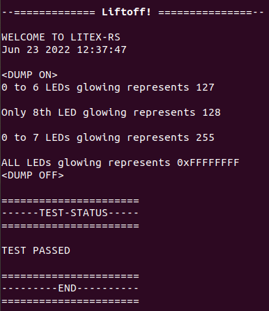
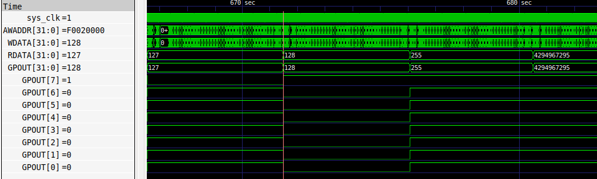

# Vexriscv SoC with UART and AXI-GPIO
GPIO LED application code running on a Vexriscv. This design contains a Vexriscv processor, ON chip ram, GPIO and UART.

### Instructions:
You can follow the below steps to generate the designs and simulate the application on Verilator.


## Generate Verilog for the LiteX design (No Simulation)

```
litex_sim --cpu-type vexriscv --axigpio --no-compile-gateware 
```

## Generate and Simulate the verilog for the LiteX design
Here we simulate the GPIO LED example using litex_sim_rs script provided in the example design directory.

### The following command generates your SoC:
```
~/litex_instll/litex_rs/Example_designs/Vexriscv_axi_gpio_led/litex_sim_rs.py --integrated-main-ram-size=0x10000 --cpu-type=vexriscv --axigpio --no-compile-gateware --sim-debug
```

### Generate binary for the application code

Run the following command to generate .bin file:
```
python3 ~/litex_instll/litex_rs/Example_designs/Vexriscv_axi_gpio_led/test/demo/demo.py --build-path=build/sim
```
### Simulating the application using Verilator

Run the following command to execute your application code onto the processor:
```
~/litex_instll/litex_rs/Example_designs/Vexriscv_axi_gpio_led/litex_sim_rs.py --integrated-main-ram-size=0x10000 --axigpio --cpu-type vexriscv --ram-init=demo.bin --sim-debug 
```




### Output:



## Application
This test performs the write operations on GPIO LEDs. This can be seen on waves(VCD) and hardware.

# Compile design for a Gemini FPGA Device

### Source Raptor for compilation

Raptor needs to be sourced before using Gemini.py

### Compiling a design on Raptor for Gemini device

```
~/litex_instll/litex_rs/Example_designs/Vexriscv_axi_gpio_led/gemini.py --toolchain=Raptor --device=gemini --cpu-type=vexriscv --axigpio --build
```

