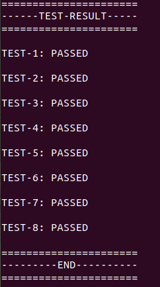

# Vexriscv SoC with UART & RAM
This example integrates an AXI based RAM to a Vexriscv based SoC.

### Instructions:
Copy the demo folder from litex installation directory ``litex/litex/soc/software/demo`` and paste it inside your project directory. Use the main.c file provided in test folder of this example and replace it with the main.c file located inside your newly copied demo folder in project directory.


## Generate the design

```
litex_sim --cpu-type vexriscv --axiram --no-compile-gateware 
```

## 1. Simulation using the test application code
We can simulate this IP using litex_sim tool in litex.

Run the following command to generate your SoC:
```
litex_sim --integrated-main-ram-size=0x10000 --cpu-type vexriscv --sim-debug --no-compile-gateware --axiram
```
Run the following command to generate .bin file from .py file:
```
python3 ./demo/demo.py --build-path=build/sim
```
Before running the simulation, you have to create the binary of your application code residing in demo. The python script below converts the application code to demo.bin, which is later loaded on to the RAM.

Run the following command to execute your application:
```
litex_sim --integrated-main-ram-size=0x10000 --cpu-type vexriscv --ram-init=demo.bin --sim-debug --axiram
```
### Output:



## Application
This application code does multiple tests onto the axiram, these tests do multiple write and read sequences on the ram to test the integration of the IP.