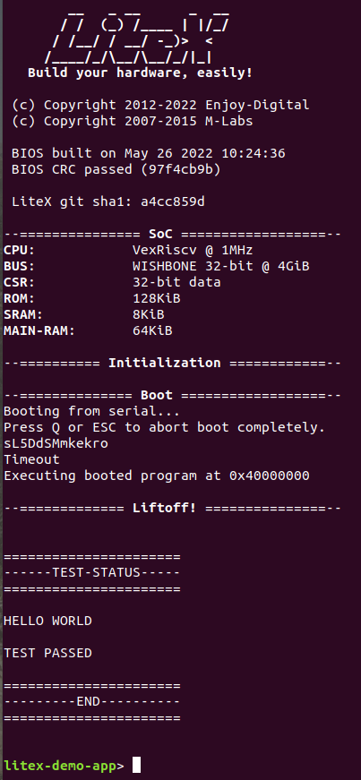

# Vexriscv SoC with UART & Hello World:
Hello World application code for Vexriscv based SoC.

### Instructions:
You can follow the below steps for generating the designs and running the application code or you can use the ```Makefile``` to automatically generate this.

## 1. Simulation:
We can simulate the hello world example using litex_sim_rs script provided in the example.

Run the following command to generate your SoC:
```

~/litex_instll/litex_rs/raptor_example_designs/Vexriscv_helloworld/litex_sim_rs.py --integrated-main-ram-size=0x10000 --cpu-type=vexriscv --no-compile-gateware --sim-debug

            
litex_sim --integrated-main-ram-size=0x10000 --cpu-type=vexriscv --no-compile-gateware --sim-debug
```
Before running the simulation, you have to create the binary of your application code residing in demo. The python script below generates the binary from application code as demo.bin, which is later loaded on to the system.

Run the following command to generate .bin file from .py file:
```
python3 ./demo/demo.py --build-path=build/sim
```
Run the following command to execute your applicationcode onto the processor:
```
litex_sim --integrated-main-ram-size=0x10000 --cpu-type vexriscv --ram-init=demo.bin --sim-debug
```


## Output:


## Application
This application code prints a Hello World onto the terminal via Uart.