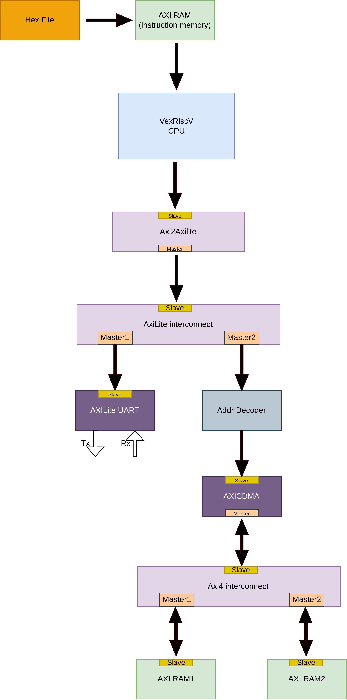

# AXICDMA IP Integration with VexRiscV CPU via AXILite Interconnect

## Design
This model consists of a VexRiscv CPU in an AXI4 implementation, connected to an AXICDMA as a peripheral via an  AXILite interconnect communicating with the CPU with an AXI2AXILite bridge and AXICDMA connected with two different AXI BLOCK RAM via an AXI interconnect. The CPU loads instructions from another AXI memory connected directly to the CPU instruction bus, without any interconnect, as an embedded memory serving the purpose of a ROM. The sources of all the IPs used can also be found below this document as well as a pictoral visualisation of this model as below: -

<p align="center">
  
</p>

## VexRiscv CPU
The VexriscV CPU is sourced from the opensource SpinalHDL's repository **Vexriscv** from [here](https://github.com/SpinalHDL/VexRiscv/blob/master/src/main/scala/vexriscv/demo/VexRiscvAxi4WithIntegratedJtag.scala) in a non-cached AXI4 configuration. This CPU is responsible for performing all the desired operations on connected peripherals. 

## AXI2AXILite Bridge
To access AXILite Peripherals that do not have support for the complete AXI4 protocol, an AXI2AXILite bridge is utilized that translates the AXI4 transactions into AXILite transactions with minimal performance overhead. It does so by utilizing a FIFO to store the calculated addresses of the burst transactions of the AXI4 protocol and executing them in an AXILite fashion.

## AXILite Inteconnect
To access AXILite Peripherals that do not have support for the complete AXI4 protocol, an AXI2AXILite bridge is utilized that translates the AXI4 transactions into AXILite transactions with minimal performance overhead. It does so by utilizing a FIFO to store the calculated addresses of the burst transactions of the AXI4 protocol and executing them in an AXILite fashion. It is parametrized in a 1x2 configuration.

## AXILite UART
A UART is connected as the second peripheral to the CPU and this UART generates five types of interrupts based on the state and operation of UART. This UART is connected in a loopback sense so as to check the data validity by receiving the same data as was transmitted.

## Address Decoder
This serves as the Address Decoder to remove the offset of AXI interface for the CDMA connected to this Address Decoder.

## AXICDMA
This serves to provide a high-speed data transfer mechanism between different memory spaces in FPGA designs, with the added benefit of being free to use, modify and distribute. AXI CDMA can improve system performance by reducing CPU overhead and enabling efficient data movement in a wide range of FPGA applications.

## AXI Inteconnect
This serves as the interconnect between CPU and peripherals, this design is based on a 1x2 Interconnect configuration that is connected ahead of the CDMA.

## AXI RAM
Three instances of AXI4 Block Ram are used in this model. One connected directly to the CPU with the IBus to serve the purpose of ROM. This ROM is loaded with a hex file which contains the instructions for the CPU. The other two instance is used as a peripheral for the system, the AXICDMA attempts read and write accesses to these Rams.

## Generating HEX
The instructions for the **ROM** are generated via bare metal C code, the libraries for which are sourced from [this](https://github.com/SpinalHDL/VexRiscvSocSoftware) opensource GitHib repository. After writing the C code for the required functions on the connected peripheral AXI RAM, generate the **.elf** by running the makefile in the bare-metal directory as below:
```
echo RISCV_PATH={path-to-riscv-toolchain}
make
// This will generate .elf, .asm, .hex, .v, .map files in the /build directory
```
To generate the Verilog readable **.hex** file from this **.elf**, that the ROM can read from, the following command can then be used: -
```
riscv64-unknown-elf-elf2hex --bit-width {requried bit-width} --input {path to the .elf file} --output {name and path for the new generated .hex file}
```
Make sure to put the generated .hex into the $readmemh block in the instruction AXI memory i.e. ROM.

## Run on Verilator
Clone the repository and move to the **vexriscv_axi_cdma** directory by the following commands: -
```
git clone git@github.com:RapidSilicon/litex_reference_designs.git
cd litex_reference_designs/rtl_designs/vexriscv_axi_cdma
```
Invoke Verilator and run the simulation by typing out the following commands on the terminal: -
```
verilator -Wno-fatal -sc -exe ./sim/testbench.v ./sim/verilator_tb.cpp ./rtl/*.v --timing --timescale 1ns/1ps --trace
make -j -C obj_dir/ -f Vtestbench.mk Vtestbench
obj_dir/Vtestbench
```
The dumped **tb.vcd** file can be easily opened via Gtkwave: -
```
gtkwave tb.vcd
```

## Run on Icarus
Move to the **vexriscv_axi_cdma** directory by following commands shown in the **Run on Verilator** section. Then invoke Iverilog and run the simulaiton by typing out the following commands on the terminal: -
```
iverilog -g2012 rtl/*.v sim/*.v -o vex_soc -Irtl/
vvp vex_soc
```
The dumped **tb.vcd** file can be easily opened via Gtkwave as shown earlier.

## Run on VCS
Move to the **vexriscv_axi_cdma** directory by following commands shown in the **Run on Verilator** section. Then invoke VCS and run the simulaiton by typing out the following commands on the terminal: -
```
vcs ./rtl/*.v ./sim/*.v -sverilog -debug_access -full64
./simv
```
The dumped **tb.vcd** file can be easily opened via Gtkwave as shown earlier.

### Resources
[VexRiscvAXI](https://github.com/SpinalHDL/VexRiscv/blob/master/src/main/scala/vexriscv/demo/VexRiscvAxi4WithIntegratedJtag.scala)

[AXI4 Interconnect](https://github.com/alexforencich/verilog-axi/blob/master/rtl/axi_interconnect.v)

[AXI RAM](https://github.com/alexforencich/verilog-axi/blob/master/rtl/axi_ram.v)

[VexRiscv Bare Metal Libraries](https://github.com/SpinalHDL/VexRiscvSocSoftware) 
