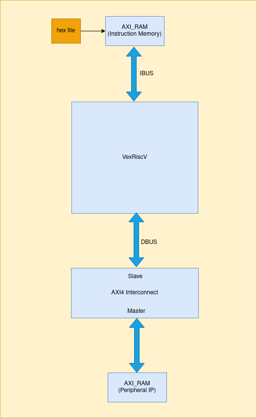

# IP Integration with VexRiscV CPU via AXI Interconnect

## Design
This model consists of a VexRiscv CPU in an AXI4 implementation, connected to an AXI Block RAM as a peripheral via an AXI interconnect. The CPU loads instructions from another AXI memory connected directly to the CPU instruction bus, without any interconnect, as an embedded memory serving the purpose of a ROM. The sources of all the IPs used can also be found below this document as well as a pictoral visualisation of this model as below: -



## VexRiscv CPU
The VexriscV CPU is sourced from the opensource SpinalHDL's repository **Vexriscv** from [here](https://github.com/SpinalHDL/VexRiscv/blob/master/src/main/scala/vexriscv/demo/VexRiscvAxi4WithIntegratedJtag.scala) in a non-cached AXI4 configuration. This CPU is responsible for performing all the desired operations on connected peripherals. 

## AXI Inteconnect
This serves as the interconnect between CPU and peripherals, this design is based on a 1x1 Interconnect configuration.

## AXI RAM
Two instances of AXI4 Block Ram are used in this model. One connected directly to the CPU with the IBus to serve the purpose of ROM. This ROM is loaded with a hex file which contains the instructions for the CPU. The second instance is used as a peripheral for the system, the CPU attempts read and write accesses to this Ram.

## Generating HEX
The instructions for the **ROM** are generated via bare metal C code, the libraries for which are sourced from [this](https://github.com/SpinalHDL/VexRiscvSocSoftware) opensource GitHib repository. After writing the C code for the required functions on the connected peripheral AXI RAM, generate the **.elf** by running the makefile in the bare-metal directory as below:
```
echo RISCV_PATH={path-to-riscv-toolchain}
make
// This will generate .elf, .asm, .hex, .v, .map files in the /build directory
```
To generate the Verilog readable **.hex** file from this **.elf**, that the ROM can read from, the following command can then be used: -
```
riscv64-unknown-elf-elf2hex --bit-width {requried bit-width} --input {path to the .elf file} --output {name and path for the new generated .hex file}
```
Make sure to put the generated .hex into the $readmemh block in the instruction AXI memory i.e. ROM.
### Resources
[VexRiscvAXI](https://github.com/SpinalHDL/VexRiscv/blob/master/src/main/scala/vexriscv/demo/VexRiscvAxi4WithIntegratedJtag.scala)

[AXI4 Interconnect](https://github.com/alexforencich/verilog-axi/blob/master/rtl/axi_interconnect.v)

[AXI RAM](https://github.com/alexforencich/verilog-axi/blob/master/rtl/axi_ram.v)

[VexRiscv Bare Metal Libraries](https://github.com/SpinalHDL/VexRiscvSocSoftware) 
