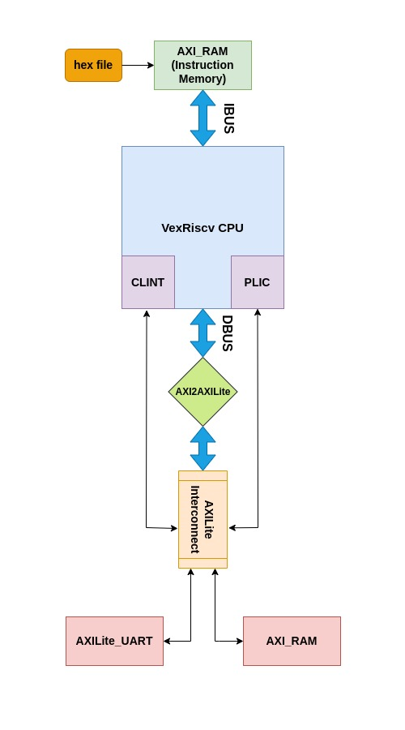

# IPs Integration with VexRiscv CPU enabling the PLIC and CLINT

## Design
This model consists of a VexRiscv CPU in an AXI4 implementation with PLIC and CLINT modules, connected to an AXI Block RAM and and AXILite UART as peripherals via an AXILite interconnect communicating with the CPU with an AXI2AXILite bridge. The CPU loads instructions from another AXI memory connected directly to the CPU instruction bus, without any interconnect, as an embedded memory serving the purpose of a ROM. The CPU then executes the instructions on the attached IPs handling interrupts according to the written ISR. The sources of all the IPs used can also be found below this document as well as a pictoral visualisation of this model as below: -

<p align="center">
  
</p>

## VexRiscv CPU
The VexriscV CPU is sourced from the opensource SpinalHDL's repository **Vexriscv** from [here](https://github.com/SpinalHDL/VexRiscv/blob/master/src/main/scala/vexriscv/demo/VexRiscvAxi4LinuxPlicClint.scala). This CPU is responsible for performing all the desired operations on connected peripherals while. The PLIC is responsible for handling external IP interrupts while the CLINT is responsible for handling of the internal local inter-processor-interrupts.

## AXI2AXILite Bridge
To access AXILite Peripherals that do not have support for the complete AXI4 protocol, an AXI2AXILite bridge is utilized that translates the AXI4 transactions into AXILite transactions with minimal performance overhead. It does so by utilizing a FIFO to store the calculated addresses of the burst transactions of the AXI4 protocol and executing them in an AXILite fashion.

## AXILite Inteconnect
This serves as the interconnect between the CPU, via the AXI2AXILite bridge, and peripherals. This design is based on a 1x4 Interconnect configuration.

## AXI RAM
Two instances of AXI4 Block Ram are used in this model. One connected directly to the CPU with the IBus to serve the purpose of ROM. This ROM is loaded with a hex file which contains the instructions for the CPU. The second instance is used as a peripheral for the system, the CPU attempts read and write accesses to this Ram.

## AXILite UART
A UART is connected as the second peripheral to the CPU and this UART generates five types of interrupts based on the state and operation of UART. This UART is connected in a loopback sense so as to check the data validity by receiving the same data as was written.

## PLIC and CLINT
The PLIC and CLINT modules are connected as the fourth and third masters to the interconnect. CLINT handles all the inter-processor timer interrupts based on the number of cores and HARTs in the RISCV CPU. Whereas the PLIC is responsible for handling all the interrupts of the external IPs, such as UART in this example design. UART raises an interrupt and it flows to the CPU via the PLIC module which then handles the interrupt before resuming the normal operation.

## Generating HEX
The instructions for the **ROM** are generated via bare metal C code, the libraries for which are sourced from [this](https://github.com/SpinalHDL/VexRiscvSocSoftware) opensource GitHib repository. After writing the C code for the required functions on the connected peripheral AXI RAM, generate the **.elf** by running the makefile in the bare-metal directory as below:
```
echo RISCV_PATH={path-to-riscv-toolchain}
make
// This will generate .elf, .asm, .hex, .v, .map files in the /build directory
```
To generate the Verilog readable **.hex** file from this **.elf**, that the ROM can read from, the following command can then be used: -
```
riscv64-unknown-elf-elf2hex --bit-width {requried bit-width} --input {path to the .elf file} --output {name and path for the new generated .hex file}
```
Make sure to put the generated .hex into the $readmemh block in the instruction AXI memory i.e. ROM.

## (Not Running on Verilator for now)
Clone the repository and move to the **vexriscv_axi_ram** directory by the following commands: -
```
git clone git@github.com:RapidSilicon/litex_reference_designs.git
cd litex_reference_designs/rtl_designs/vexriscv_axi_ram
```
Invoke Verilator and run the simulation by typing out the following commands on the terminal: -
```
verilator -Wno-fatal -sc -exe ./sim/testbench.v ./sim/verilator_tb.cpp ./rtl/*.v --timing --timescale 1ns/1ps --trace
make -j -C obj_dir/ -f Vtestbench.mk Vtestbench
obj_dir/Vtestbench
```
The dumped **tb.vcd** file can be easily opened via Gtkwave: -
```
gtkwave tb.vcd
```

## Run on Icarus
Move to the **vexriscv_axi_cdma** directory by following commands shown in the **Run on Verilator** section. Then invoke Iverilog and run the simulation by typing out the following commands on the terminal: -
```
iverilog -g2012 rtl/*.v sim/*.v -o vex_soc -Irtl/
vvp vex_soc
```
The dumped **tb.vcd** file can be easily opened via Gtkwave as shown earlier.

## Run on VCS
Move to the **vexriscv_axi_ram** directory by following commands shown in the **Run on Verilator** section. Then invoke VCS and run the simulation by typing out the following commands on the terminal: -
```
vcs rtl/*.v +incdir+rtl/ sim/*.v -sverilog -debug_access -full64
./simv
```
The dumped **tb.vcd** file can be easily opened via Gtkwave as shown in the previous section.

### Resources
[VexRiscv](https://github.com/SpinalHDL/VexRiscv/blob/master/src/main/scala/vexriscv/demo/VexRiscvAxi4LinuxPlicClint.scala)

[AXI2AXILite Bridge](https://github.com/ZipCPU/wb2axip/blob/master/rtl/axi2axilite.v)

[AXILite Interconnect](https://github.com/alexforencich/verilog-axi/blob/master/rtl/axil_interconnect.v)

[AXI RAM](https://github.com/alexforencich/verilog-axi/blob/master/rtl/axi_ram.v)

[AXILite UART](https://github.com/freecores/uart16550)

[VexRiscv Bare Metal Libraries](https://github.com/SpinalHDL/VexRiscvSocSoftware) 

[PLIC and CLINT Drivers](https://github.com/SpinalHDL/SaxonSoc)
